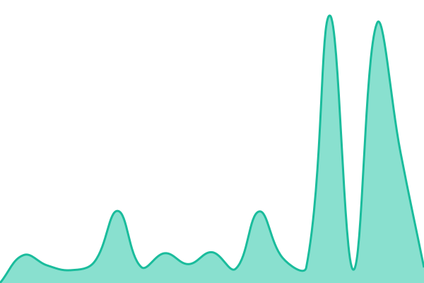
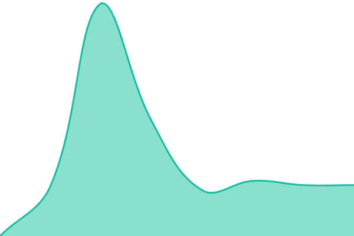

# [📈 Live Status](https://j4lc.github.io/externalmonitoring): <!--live status--> **🟧 Partial outage**

This repository contains the open-source uptime monitor and status page for [Jae Salokettu](https://iki.fi/~jae), powered by [Upptime](https://github.com/upptime/upptime).

With [Upptime](https://upptime.js.org), you can get your own unlimited and free uptime monitor and status page, powered entirely by a GitHub repository. We use [Issues](https://github.com/j4lc/externalmonitoring/issues) as incident reports, [Actions](https://github.com/j4lc/externalmonitoring/actions) as uptime monitors, and [Pages](https://j4lc.github.io/externalmonitoring) for the status page.

<!--start: status pages-->
<!-- This summary is generated by Upptime (https://github.com/upptime/upptime) -->
<!-- Do not edit this manually, your changes will be overwritten -->
<!-- prettier-ignore -->
| URL | Status | History | Response Time | Uptime |
| --- | ------ | ------- | ------------- | ------ |
|  [GitLab Pages](https://jae.fi) | 🟩 Up | [git-lab-pages.yml](https://github.com/j4lc/externalmonitoring/commits/HEAD/history/git-lab-pages.yml) | 

 851ms
     
 | 

<a href="https://j4lc.github.io/externalmonitoring/history/git-lab-pages">100.00%</a>
    

|  [GitLab Interface](https://g.j4.lc) | 🟩 Up | [git-lab-interface.yml](https://github.com/j4lc/externalmonitoring/commits/HEAD/history/git-lab-interface.yml) | 

 1380ms
     
 | 

<a href="https://j4lc.github.io/externalmonitoring/history/git-lab-interface">100.00%</a>
    

|  [FreshRSS](https://rss.jae.fi) | 🟥 Down | [fresh-rss.yml](https://github.com/j4lc/externalmonitoring/commits/HEAD/history/fresh-rss.yml) | 

 0ms
     
 | 

<a href="https://j4lc.github.io/externalmonitoring/history/fresh-rss">15.71%</a>
    

|  [Blog](https://b.j4.lc) | 🟩 Up | [blog.yml](https://github.com/j4lc/externalmonitoring/commits/HEAD/history/blog.yml) | 

 1863ms
     
 | 

<a href="https://j4lc.github.io/externalmonitoring/history/blog">100.00%</a>
    

|  [PBX](https://pbx.jae.fi) | 🟩 Up | [pbx.yml](https://github.com/j4lc/externalmonitoring/commits/HEAD/history/pbx.yml) | 

 1423ms
     
 | 

<a href="https://j4lc.github.io/externalmonitoring/history/pbx">100.00%</a>
    

|  [Vaultwarden](https://bw.j4.lc) | 🟥 Down | [vaultwarden.yml](https://github.com/j4lc/externalmonitoring/commits/HEAD/history/vaultwarden.yml) | 

 0ms
     
 | 

<a href="https://j4lc.github.io/externalmonitoring/history/vaultwarden">21.15%</a>
    

|  [Cloud](https://cloud.jae.fi) | 🟩 Up | [cloud.yml](https://github.com/j4lc/externalmonitoring/commits/HEAD/history/cloud.yml) | 

 3456ms
     
 | 

<a href="https://j4lc.github.io/externalmonitoring/history/cloud">100.00%</a>
    

|  [Office](https://office.jae.fi) | 🟥 Down | [office.yml](https://github.com/j4lc/externalmonitoring/commits/HEAD/history/office.yml) | 

 0ms
     
 | 

<a href="https://j4lc.github.io/externalmonitoring/history/office">25.73%</a>
    

|  [Media](https://media.jae.fi) | 🟩 Up | [media.yml](https://github.com/j4lc/externalmonitoring/commits/HEAD/history/media.yml) | 

 1110ms
     
 | 

<a href="https://j4lc.github.io/externalmonitoring/history/media">100.00%</a>
    

|  [SSO](https://id.j4.lc) | 🟥 Down | [sso.yml](https://github.com/j4lc/externalmonitoring/commits/HEAD/history/sso.yml) | 

 0ms
     
 | 

<a href="https://j4lc.github.io/externalmonitoring/history/sso">36.89%</a>
    

|  [Matrix](https://matrix.j4.lc) | 🟩 Up | [matrix.yml](https://github.com/j4lc/externalmonitoring/commits/HEAD/history/matrix.yml) | 

 1296ms
     
 | 

<a href="https://j4lc.github.io/externalmonitoring/history/matrix">100.00%</a>
    

<!--end: status pages-->

[**Visit our status website →**](https://j4lc.github.io/externalmonitoring)

## 📄 License

- Powered by: [Upptime](https://github.com/upptime/upptime)
- Code: [MIT](./LICENSE) © [Anand Chowdhary](https://anandchowdhary.com)
- Data in the `./history` directory: [Open Database License](https://opendatacommons.org/licenses/odbl/1-0/)
